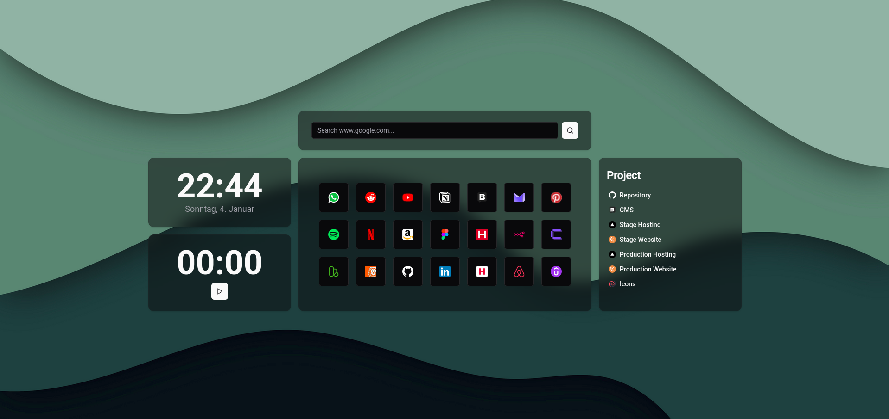
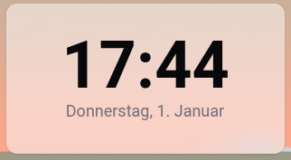
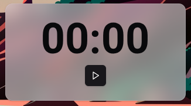
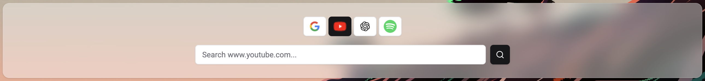
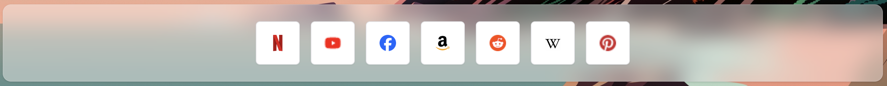
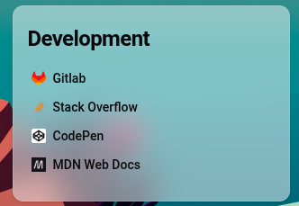

# Better Browser Start-Page

This project provides a fully customizable browser start page/ new tab page.
It allows you to:

- search your favorite search engines
- organize and group your links
- use a ever expanding list of useful widgets

You can make it look the way you like using themes. It supports both dark- and light-mode.

## Example Gallery




## Setup

1. Clone the repository.
2. Run `npm install`.
3. Run `node setup`. This will initialize the config files for you and will fill it with test data.
4. Start a dev server: `npm run dev`
5. Verify the site renders by opening [http://localhost:5173](http://localhost:5173) in your browser.
6. Configure the app (see the "Configuration" section for instructions).
7. Run `npm run build`.
8. Navigate to the `dist` folder and copy the full path to the `index.html` file (e.g., `/Users/<YourUser>/git/better-browser-start-page/dist/index.html`).
9. You can then link to this url in your browser to set this as your start page.

> **Note:** If you update the configuration, you need to run `npm run build`. However you don't need to redo all the other steps.

## Configuration

> **INFO:** You can find an example by viewing the `example.app.config.json` file in the root of this project.

The app can be fully customized using JSON-configuration. The configuration is straightforward and quick. This guide explains how to set up each widget.

### Widgets

#### General

Each widget gets positioned in a grid (4 columns wide, endless columns long).
Every widget has a `gridArea` attribute, that gets mapped to a [CSS Grid-Area](https://developer.mozilla.org/en-US/docs/Web/CSS/Reference/Properties/grid-area).

Example:

```json
{
  "type": "...",
  "gridArea": {
    "rowStart": 1,
    "rowEnd": 2,
    "columnStart": 1,
    "columnEnd": 2
  }
}
```

#### Clock Widget



This widget displays the time and current date.

```json
{
  "type": "clock-widget",
  "gridArea": {
    // ...
  }
},
```

#### Stopwatch Widget



This widget contains a stopwatch, you can use for time tracking.
Note: It resets when you close the tab!

```json
{
  "type": "stopwatch-widget",
  "gridArea": {
    "rowStart": 1,
    "rowEnd": 2,
    "columnStart": 4,
    "columnEnd": 5
  }
},
```

#### Search Widget



This widget allows you to configure search for your favorite websites.
A toggle group allows you to specify which search engine you want to use
and an input allows you to enter a query.
The widget will replace `{query}`in the url, with the query
you have entered in your input and then redirect you to the page.

_Example config:_

```ts
{
  "type": "search-widget",
  "gridArea": {
    // ...
  },
  "elements": [
    {
      // must contain {query}
      "url": "https://www.google.com/search?q={query}",
      // optional, use when favicon does not get loaded automatically
      "faviconUrl": "https://www.google.com/favicon.ico"
    },
    // ...
  ]
}
```

_Common Search URLs:_

- Google: `https://www.google.com/search?q={query}`
- YouTube: `https://www.youtube.com/results?search_query={query}`
- Amazon: `https://www.amazon.com/s?k={query}`
- Yahoo: `https://search.yahoo.com/search?p={query}`
- Bing: `https://www.bing.com/search?q={query}`
- DuckDuckGo: `https://duckduckgo.com/?q={query}`
- Reddit: `https://www.reddit.com/search/?q={query}`
- X (Twitter): `https://twitter.com/search?q={query}`
- GitHub: `https://github.com/search?q={query}`
- GitLab: `https://gitlab.com/search?search={query}`

#### Apps Widget



This widget allows you to store links to your most important apps and websites in one place.

_Example config:_

```ts
{
  "type": "apps-widget",
  "gridArea": {
    // ...
  },
  "elements": [
    {
        "url": "https://www.figma.com/",
      // optional, use when favicon does not get loaded automatically
        "faviconUrl": "https://static.figma.com/app/icon/1/favicon.svg"
    },
    // ...
  ]
}
```

#### Links Widget



Use this widget to create a link list by a specific topic or website.
Let's say you are a developer and you want to store the links to the designs, docs, test pages, repo etc. related to your project. Then this would be the perfect widget for you.

_Example config:_

```ts
{
  "type": "links-widget",
  "gridArea": {
    // ...
  },
  "title": "Development",
  "elements": [
    {
        "label": "Gitlab",
        "url": "https://gitlab.com/",
        // optional, use when favicon does not get loaded automatically
        "faviconUrl": "https://gitlab.com/favicon.svg"
    },
    // ....
  ]
}
```

## Development

Before starting development, follow the setup and configuration guides. Below are additional resources and instructions for developers.

### Important Commands

- Start Dev Server (http://localhost:5173): `npm run dev`
- Create a production build: `npm run build`
- Lint code: `npm run lint`
- Auto-fix linting issues: `npm run lint:fix`
- Preview production build: `npm run preview`

### Development Stack

- **Bundler:** [Vite](https://vite.dev/) with [vite-plugin-singlefile](https://www.npmjs.com/package/vite-plugin-singlefile), so the production build does not need a webserver like nginx to run it
- **Language:** [TypeScript](https://www.typescriptlang.org/)
- **Frontend Framework:** [React](https://react.dev/)
- **UI Library:** [Shadcn](https://ui.shadcn.com/) (based on [RadixUI](https://www.radix-ui.com/))
- **CSS Framework:** [Tailwind CSS](https://tailwindcss.com/)
- **Icons:** [Lucide](https://lucide.dev/)

## Contributions

Contributions are welcome!
Also let me know if you find any bugs and if you have any feature requests or other suggestions.

To get started with contributing:

1. For bigger changes: Open an issue to discuss your ideas first. You can also pick one of the existing ones.
2. Fork the repository
3. Create a feature branch
4. Commit your changes with clear messages
5. Submit a pull request

Please ensure your code passes linting and adheres to the project structure.

## Credit

Wallpapers are by <a href="https://www.freepik.com/free-vector/abstract-paper-cut-shape-wave-background_302899580.htm#fromView=author&page=1&position=0&uuid=954b92a6-99ce-456b-817b-ead37a14a4d4">soepratman on Freepik</a>
