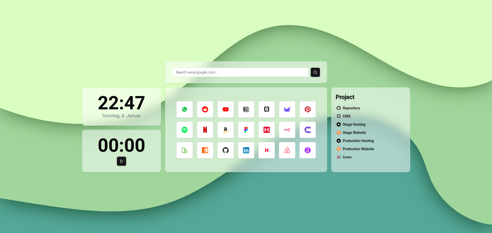
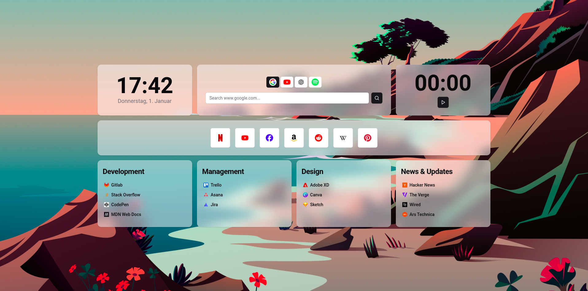
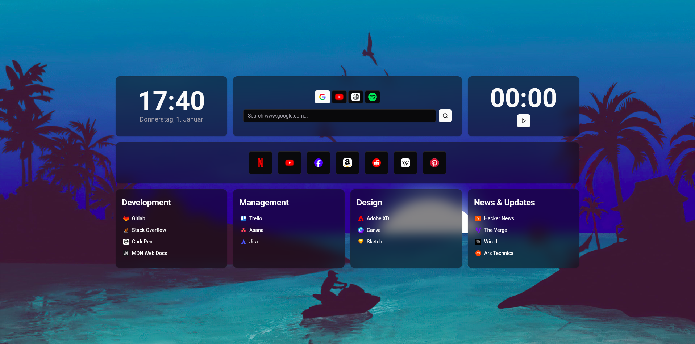
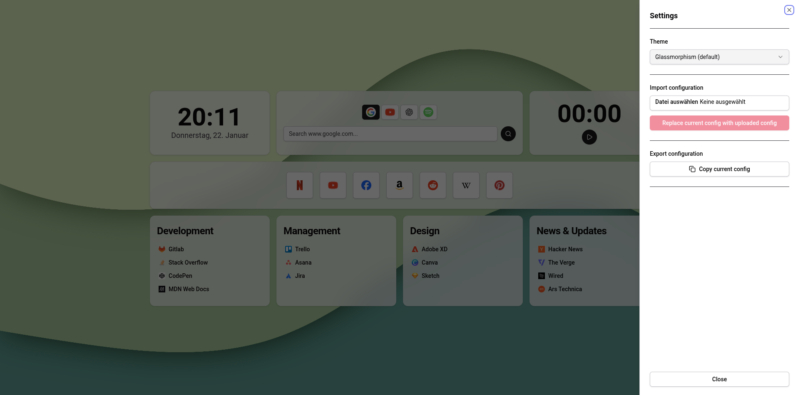
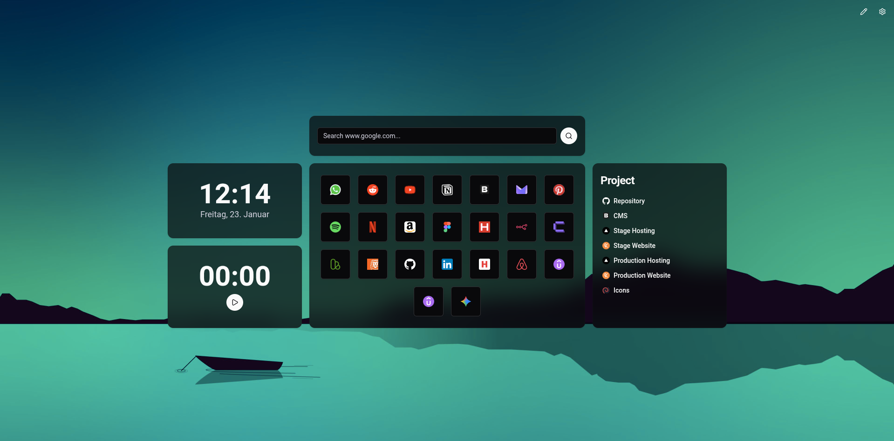
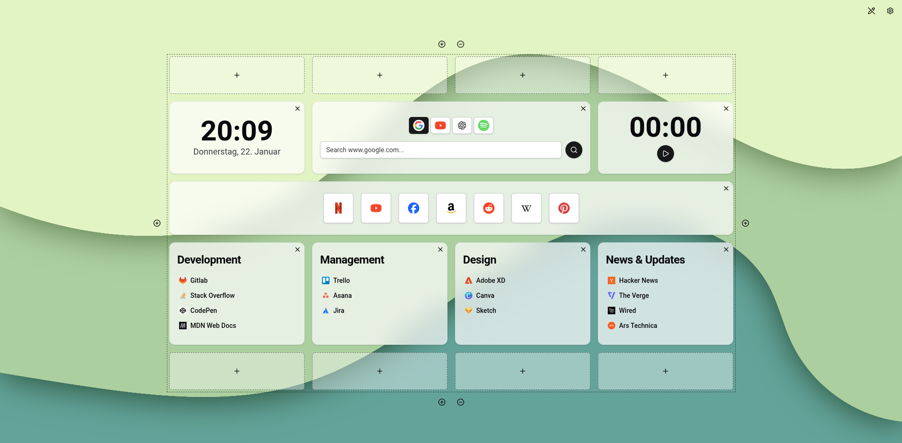
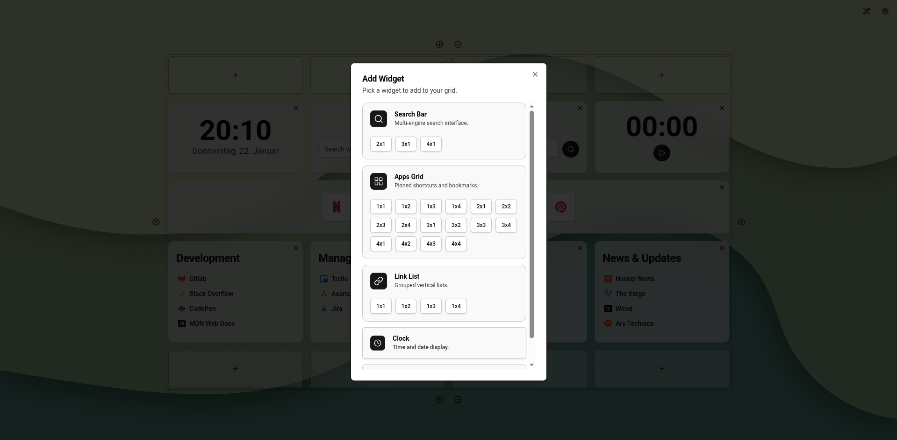

# Better Browser Start-Page

This project provides a fully customizable browser start page/ new tab page.
It allows you to:

- **Visual Editing:** Design your layout directly in the browser
- **Search:** Configure and search your favorite search engines.
- **Organize:** Group and categorize your links efficiently.
- **Widgets:** Use an ever-expanding list of useful widgets (Clock, Stopwatch, etc.).
- **Multi-language Support:** Available in English and German.

You can make it look the way you like using themes and the visual editor. You can import and export your configuration, if you want to do a backup or switch to a different browser.

> Note: This project will become a browser extension in the future

Also this project is open source. We don't track you and your data does not get stored on the cloud.

> Note: Make sure to backup your configuration from time to time, as it is only stored in local storage.

## Themes

### Glassmorphism

### Glassmorphism Dark

### Changing Themes

You can switch themes in the settings under the **Appearance** tab.

### Custom Wallpaper

You can upload your own custom wallpaper/background image to personalize your start page. The custom wallpaper will override the theme's default wallpaper and will persist even when switching between themes.

- **Upload Custom Wallpaper:** Go to settings, open the **Appearance** tab, and use the "Custom Background" option to upload an image file
- **Clear Custom Wallpaper:** Use the clear button in the **Appearance** tab to revert back to the theme's default wallpaper
- **Persistence:** Your custom wallpaper is saved in your configuration and will persist across page reloads

## Language Support

The application supports multiple languages. Currently available:

- **English** (default)
- **German** (Deutsch)

### Changing Language

You can switch languages in the settings under the **Appearance** tab. The language preference is saved in your configuration and will persist across page reloads.

- All UI elements, labels, and messages will be translated to the selected language
- The clock widget will display dates and times in the appropriate locale format
- Widget labels and descriptions in the widget selection dialog will be translated

## Visual Editor

The app features a built-in **Visual Editor**, making it easy to create a unique workspace without touching any code.

- **Enable Edit Mode:** Toggle the edit switch in the navigation to reveal the grid controls.
- **Grid Manipulation:** Use the `+` buttons on the edges to expand your workspace or the `-` buttons to contract it.
  - _Note: A row or column can only be removed if it contains no widgets._
- **Add Widgets:** Click the `+` icon in any empty grid cell to choose from the widget library.

## Widgets

### Clock Widget

Displays the time and current date.

### Stopwatch Widget

Contains a stopwatch for time tracking. _Note: It resets when you close the tab!_

### Search Widget

Allows you to configure search for your favorite websites. The widget will replace `{query}` in the url with your input.

### Apps Widget

Store links to your most important apps with automatic favicon support.

### Links Widget

Create categorized link lists (e.g., "Development", "Design", "Management").

## Setup

1. **Clone** the repository.
2. Run `npm install`.
3. **Start** a dev server: `npm run dev`
4. Verify the site renders by opening [http://localhost:5173](http://localhost:5173) in your browser.
5. Run `npm run build`.
6. Navigate to the `dist` folder and copy the full path to the `index.html` file (e.g., `/Users/<YourUser>/git/better-browser-start-page/dist/index.html`).
7. You can then link to this url in your browser to set this as your start page.
8. **Customize:** Click the settings icon to enter **Edit Mode**.

> **Note:** Your configuration is saved locally in your browser. Make sure to back it up using the export function before clearing your cookies or browser storage!

## Migrating to a different browser

1. Go to settings, open the **Data** tab, and export your current configuration (save it as a .json file)
2. Follow the setup section and set it up for the new browser
3. In the new browser, go to settings, open the **Data** tab, and import your configuration .json file

## Outdated configurations

Outdated configurations will automatically be migrated by the application. Everything is downward compatible.

## Development

### Important Commands

- **Start Dev Server:** `npm run dev`
- **Create production build:** `npm run build`
- **Lint code:** `npm run lint`

### Development Stack

- **Bundler:** [Vite](https://vite.dev/) with `vite-plugin-singlefile` (builds into a single portable HTML file)
- **Language:** [TypeScript](https://www.typescriptlang.org/)
- **Frontend:** [React](https://react.dev/)
- **UI Library:** [Shadcn](https://ui.shadcn.com/) & [Tailwind CSS](https://tailwindcss.com/)
- **Icons:** [Lucide](https://lucide.dev/)

## Credit

Wallpapers are by <a href="https://www.freepik.com/free-vector/abstract-paper-cut-shape-wave-background_302899580.htm">soepratman on Freepik</a>
